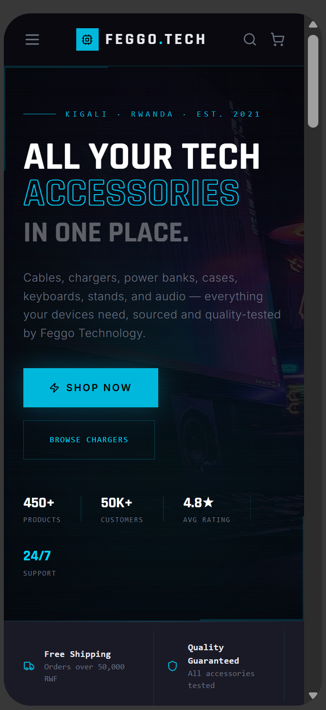
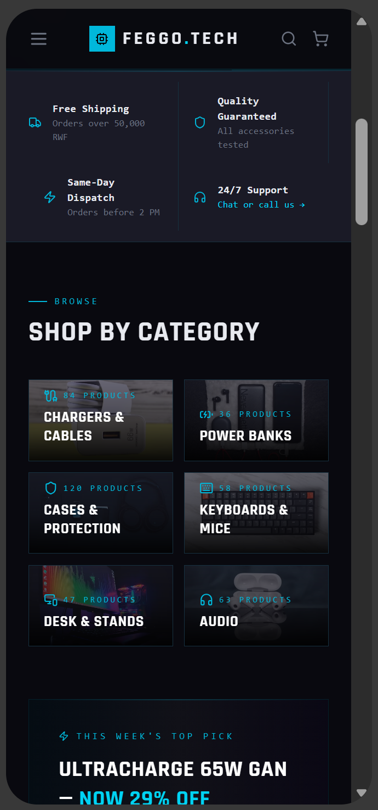
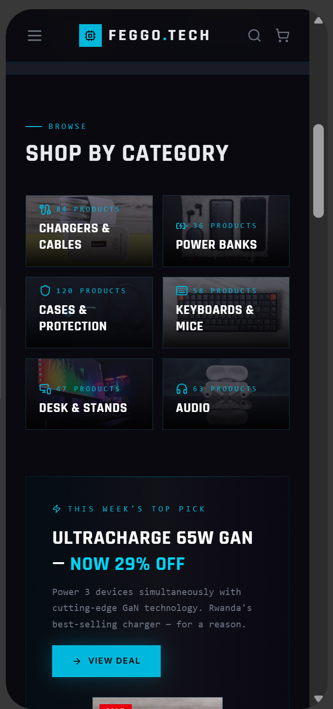
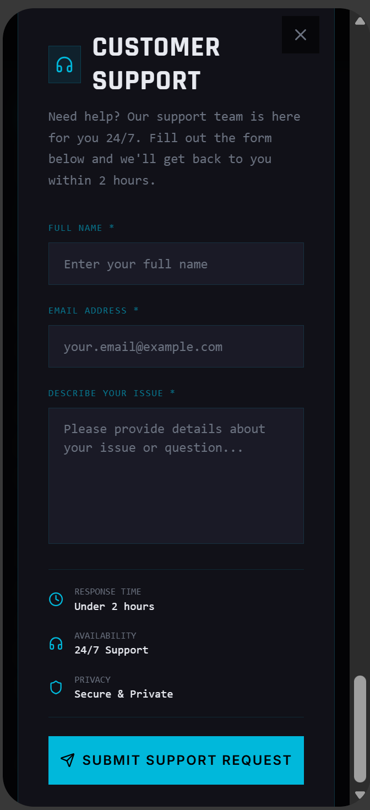
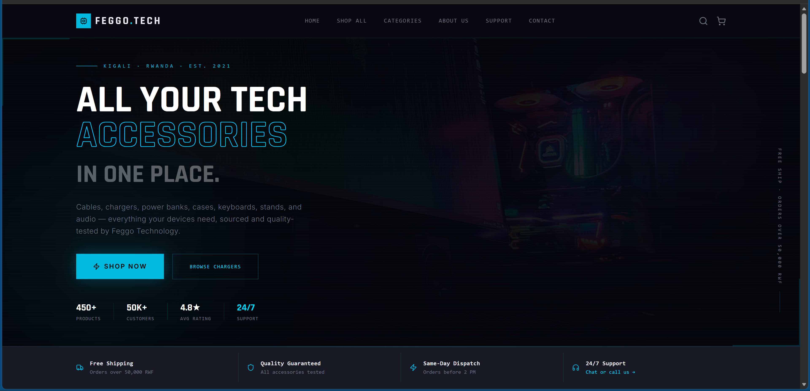

#  FEGGO.TECH Mobile App

### UI/UX Design Using Figma

---

##  Group Members
| Name | Registration Number |
|------|-------------------|
|  Nsengiyumva Jean Claude | 28524/2025 |
| Mike Mucyo | 23082/2023 |

---

## Course Information
- **Course:** E-Commerce and Web Application
- **Code:** EWA408510
- **Lecturer:** Eric Maniraguha
- **Academic Year:** 2025-2026 | Semester II

---

##  Project Title
FEGGO.TECH — Online Shopping Application (IT Accessories)

---

##  Selected Application
Online Shopping Application (IT Accessories)

---

## Problem Statement
Tech enthusiasts and professionals in Africa struggle 
to find quality IT accessories in one place. Physical 
stores have limited stock, inconsistent pricing, and 
no easy way to compare products. FEGGO.TECH is a 
mobile shopping application that allows users to 
browse, compare, and purchase IT accessories including 
chargers, power banks, keyboards, cases, audio devices 
and desk accessories — all from their smartphone with 
fast delivery and honest pricing.

### Target Users
- Tech enthusiasts aged 18-35
- Students and professionals using laptops/phones
- Remote workers needing desk accessories
- Small businesses buying tech in bulk

### Why It Matters
- Saves time searching multiple stores
- Provides product comparisons and reviews
- Supports growing tech retail in Africa
- Mobile-first shopping experience

---

## User Personal
| Field |            Details |
|-------|           ---------|
| **Name**|     David Mugisha |
| **Age**        | 24 |
| **Occupation** | University Student & Freelance Designer |
| **Location** | Kigali, Rwanda |
| **Goals** | Find affordable quality tech accessories quickly, compare products before buying, track orders easily |
| **Frustrations** | Can't find all accessories in one store, inconsistent prices, no product reviews available locally |

---

---

## 🖼️ Screenshots

### Wireframes

### High-Fidelity Designs

### Prototype

---

##  Accessibility Considerations
- High contrast text (white on dark background)
- Large readable font sizes (minimum 14px)
- Clear navigation with bottom tab bar
- Color-blind friendly cyan accent color
- Touch targets minimum 44x44px
- Descriptive button labels

---

## ✅ Features Implemented
- ✅ Homepage with hero banner and shop now button
- ✅ Categories page with all product categories
- ✅ Products page with grid layout and prices in RWF
- ✅ Contact Us page with form and location
- ✅ Support page with FAQ
- ✅ Mobile responsive design
- ✅ Dark mode UI with cyan accents
- ✅ Interactive prototype with clickable screens

---

## 💪 Challenges Faced
- Designing a consistent dark theme across all screens
- Creating an intuitive mobile navigation structure
- Balancing visual appeal with accessibility requirements
- Collaborating on Figma in real time

---

## 🎓 Conclusion
FEGGO.TECH mobile app demonstrates how modern UI/UX 
principles can create an engaging and accessible 
shopping experience for tech accessories. The design 
focuses on simplicity, speed and visual appeal to 
serve the growing African tech market.

---

## 🔗 GitHub Repository
[https://github.com/FEEGGOO/feggo-tech-mobile-app](https://github.com/FEEGGOO/feggo-tech-mobile-app)
